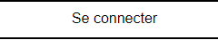
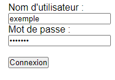
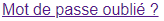
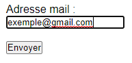

# Notice Utilisateur

## 1. Connexion au compte
Pour vous connecter à votre compte, cliquez sur "Se connecter" dans le menu.

Ensuite vous devrez rentrer les Identifiants qui vous ont été distribué au préalable.

Vous voila ensuite connecté.

### 1.2 Mot de passe oublié
Si vous avez oublié le mot de passe de votre compte, veuillez cliquer sur "Mot de passe oublié ?"

Il vous sera ensuite demandé d'entrer l'adresse e-mail liée à votre compte pour que votre mot de passe vous soit envoyé par mail.

## 2.